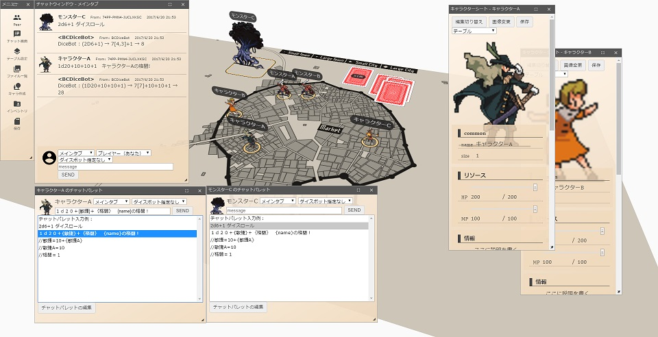

# ユドナリウム

[ユドナリウム（Udonarium）][1]はWebブラウザで動作するボードゲームオンラインセッション支援ツールです。

[](https://github.com/TK11235/udonarium/blob/master/LICENSE)

[][1]

## クイックスタート

今すぐ試したり利用したりできる公開サーバを用意しています。  
推奨ブラウザはデスクトップ版Google Chromeです。

[**ユドナリウムをはじめる**][1]

## 目次

- [機能](#機能)
- [サーバ設置](#サーバ設置)
- [開発者クイックスタート](#開発者クイックスタート)
- [開発に寄与する](#開発に寄与する)
- [今後の開発](#今後の開発)
- [License](#license)

## 機能
- **ブラウザ間通信**
  - WebRTCを利用したブラウザ間通信を実現しています。  
    サーバサイドを介さずに全ての機能をWebブラウザ上で完結させることを目指しています。
- **軽量 & リアルタイム**
  - 軽量で快適に動作し、ユーザの操作は他のユーザにリアルタイムに反映されます。
- **遊ぶ機能**
  - ルーム機能
  - 複数テーブル管理、テーブルマスク
  - 立体地形
  - コマ、カード、共有メモ
  - チャット送受信、チャットパレット
  - ダイスボット（[BCDice](https://github.com/bcdice/BCDice)を[Opal](http://opalrb.com/)でJavaScriptにトランスパイル）
  - 画像ファイル共有
  - BGM再生
  - セーブデータ生成（ZIP形式）

## サーバ設置

ユーザ自身でWebサーバを用意し、そのサーバにユドナリウムを設置して利用することができます。  

1. [リリース版（**udonarium.zip**）](../../releases/latest)をダウンロードして解凍し、Webサーバに配置してください。  
**開発者向けのソースコードをダウンロードしないように注意して下さい。**
1. [SkyWay](https://webrtc.ecl.ntt.com/)のAPIキーを取得し、APIキー情報を`assets/config.yaml`に記述します。
1. サーバに配置したユドナリウムの`index.html`にアクセスして動作することを確認してみてください。  
上手く動作しない時は付属の`上手くサーバで動かない時Q&A.txt`を参照してください。

ユドナリウムはサーバーサイドの処理を持たないので、CGIやデータベースは必要はありません。

## 開発者クイックスタート

ソースコードはそのままでは実行できません。  
開発環境を用意してビルドする必要があります。

### 開発環境
[Node.js](https://nodejs.org/)と[npm](https://www.npmjs.com/)が必要です。  

言語はTypeScriptを用い、[Angular](https://angular.io/)で実装されています。  
開発を効率化するCLIツールとして[Angular CLI](https://github.com/angular/angular-cli)を利用しています。

インストール手順は[Angular公式ページのセットアップ](https://angular.jp/guide/setup-local)が参考になります。

#### Angular CLI

リポジトリからソースコードをダウンロードした後、初回起動時のコマンドは以下のようになります。

```bash
cd ソースコードを展開したディレクトリの場所
npm install
ng serve
```

`ng serve`を実行すると`http://localhost:4200/`で開発用サーバが起動します。  
いずれかのソースコードを変更すると、アプリケーションは自動的にリロードされます。

`ng build`でプロジェクトのビルドを実行します。ビルド成果物は`dist/`ディレクトリに格納されます。  
`ng build --prod`を使用すると、最適化された本番環境向けビルドが生成されます。

#### SkyWay

このアプリケーションは通信処理にWebRTCを使用しています。  
WebRTC向けのシグナリングサーバとして[SkyWay](https://webrtc.ecl.ntt.com/)を利用しているため、動作確認のためにSkyWayのAPIキーが必要です。

取得したAPIキーの情報は`src/assets/config.yaml`に記述します。

## 開発に寄与する

バグを報告したり、ドキュメントを改善したり、開発の手助けをしたりしたいですか？

報告や要望の窓口として[GitHubのIssue](https://github.com/TK11235/udonarium/issues)、または[Twitter](https://twitter.com/TK11235)を利用できます。  
コードの[Pull Request](https://github.com/TK11235/udonarium/pulls)も歓迎です。

### 報告

バグ報告では、バグを再現できる必要十分な条件について、分かっている範囲で詳しく書いてください。  
基本的には「報告を受けて改修 → 次回更新時に反映」の流れで対応する予定です。

### 要望

機能要望では「何故それが必要なのか」について説明があると良いです。  
ただ、難易度や優先度の都合によりそっとしたままになる可能性があります。

### Pull Request

作成したコードやドキュメントをこのリポジトリに反映させたい時はPull Request（PR）を送ってください。  

PRのコードが完全ではない場合でも作業中PRとして送ることができます。  
その場合、作業中である旨をPRタイトルか説明文に付け加えてください。

## 今後の開発

最低限必要となる機能は実装されていますが、作業すべき課題が残されています。

- UIデザインおよび操作性の改善
- モバイル向け対応
- 機能追加
- ドキュメント整備

## License

[MIT License](https://github.com/TK11235/udonarium/blob/master/LICENSE)

[1]: https://udonarium.app/
