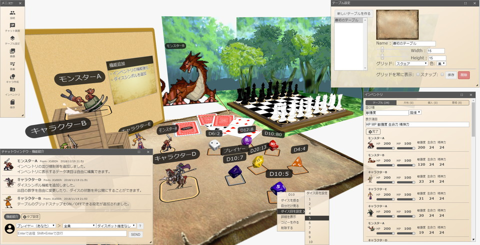

# ユドナリウム

[ユドナリウム（Udonarium）][udonarium-url]はWebブラウザで動作するボードゲームオンラインセッション支援ツールです。

[](https://github.com/TK11235/udonarium/blob/master/LICENSE)

[][udonarium-url]

## クイックスタート

今すぐ試して利用できる公開サーバを用意しています。  
推奨ブラウザはデスクトップ版Google Chrome、またはデスクトップ版Mozilla Firefoxです。

[**ユドナリウムをはじめる**][udonarium-url]

## 目次

- [機能](#機能)
- [サーバ設置](#サーバ設置)
- [開発者クイックスタート](#開発者クイックスタート)
- [開発に寄与する](#開発に寄与する)
- [今後の開発](#今後の開発)
- [License](#license)

## 機能

- **オンラインセッション**
  - ルーム機能
  - 複数テーブル管理
  - テーブルマスク、立体地形
  - コマ、カード、共有メモ
  - チャット送受信、チャットパレット
  - ダイスボット（[BCDice](https://github.com/bcdice/bcdice-js)）
  - 画像ファイル共有
  - BGM再生
  - セーブデータ生成（ZIP形式）

- **ブラウザ間通信**
  - WebRTCを利用したブラウザ間通信を実現しています。  
    ユーザ間で通信接続した後の全ての処理をWebブラウザ上で完結させることを目指しています。

- **軽量&リアルタイム**
  - 軽量で快適に動作し、ユーザの操作は別のユーザにリアルタイムに反映されます。

## サーバ設置

ユーザ自身でWebサーバを用意してユドナリウムを利用することができます。

#### 1. Webサーバにコンテンツを配置

ユドナリウムの[リリース版（**udonarium.zip**）](../../releases/latest)をダウンロードして展開し、`index.html`などコンテンツ一式をWebサーバに配置します。  
必ず**HTTPS環境のWebサーバ**に配置してください。

#### 2. ユドナリウムバックエンドの配置

[ユドナリウムバックエンド][udonarium-backend-repo]のサーバを準備します。  
詳細はユドナリウムバックエンドのリポジトリの`README.md`を参照してください。

#### 3. ユドナリウムの設定ファイル変更

Webサーバに配置したユドナリウムの`assets/config.yaml`を編集して、`backend.url`にユドナリウムバックエンドのURLを記述します。

```yaml
backend:
  mode: skyway2023
  url: https://your-udonarium-backend-url/ #Your Backend API URL
...
```

Webブラウザからユドナリウムの`index.html`にアクセスしてエラーが発生していなければ完了です。  
上手く動作しない時は付属の`上手くサーバで動かない時Q&A.txt`を参照してください。

## 開発者クイックスタート

開発環境を用意するとソースコードの修正や機能追加を行うことができます。

### 開発環境

[Node.js](https://nodejs.org/)と[npm](https://www.npmjs.com/)が必要です。

開発言語はTypeScriptを使用し、[Angular](https://angular.jp/)のフレームワークを使用して実装されています。  
環境構築の手順は[Angular公式ページのチュートリアル](https://angular.jp/tutorials/first-app)を参考にしてください。

#### Angular CLI

開発を効率化するCLIツールとして[Angular CLI](https://github.com/angular/angular-cli)を利用しています。  
`ng`コマンドを使用するのに必要です。

#### SkyWay

ユドナリウムはWebRTCを使用しており、WebRTC向けのサービスとして[SkyWay][SkyWay-url]を利用しています。  
SkyWayのアカウントとアプリケーション情報が必要です。

#### ユドナリウムバックエンド

 [SkyWay][SkyWay-url]を利用するには認証トークン（SkyWay Auth Token）を都度作成する必要がありますが、Webブラウザ側で認証トークンを作成するのはセキュリティ上の観点から望ましくありません。  
そこで、Webブラウザ側で実行できない処理は[ユドナリウムバックエンド][udonarium-backend-repo]のWeb APIとして実行します。

ローカル環境で開発を行う際には、ユドナリウムバックエンドの開発用ローカルサーバを使用することをおすすめします。

### ユドナリウムの実行

リポジトリをダウンロードした後、初回はリポジトリのディレクトリで以下のコマンドを実行してください。

```bash
npm i
```

#### 開発用ローカルサーバ

開発作業を行う際には、`src/assets/config.yaml`を編集して`backend.url`にユドナリウムバックエンドのURLを記述してください。

以下のコマンドを実行すると`https://localhost:4200/`でユドナリウムの開発用ローカルサーバが起動します。  
必ず`--ssl`オプションを使用してHTTPSのサーバを起動してください。SkyWayの一部の機能はHTTPS環境でしか実行できません。

```bash
ng serve --ssl
```

開発用ローカルサーバが起動している状態でソースコードを変更すると、アプリケーション全体が自動的にホットリロードされます。

#### 本番環境向けビルド

以下のコマンドでソースコード全体のビルドを実行します。ビルド成果物は`dist`ディレクトリ配下に格納されます。

```bash
ng build
```

## 開発に寄与する

バグを報告したり、ドキュメントを改善したり、開発の手助けをしたりしたいですか？

報告や要望の窓口として[GitHubのIssue](https://github.com/TK11235/udonarium/issues)、または[X（Twitter）](https://x.com/TK11235)を利用できます。  
コードの[Pull Request](https://github.com/TK11235/udonarium/pulls)も歓迎です。

ただ、難易度や優先度の都合によりそっとしたままになる可能性があります。

### 報告

バグ報告では、バグを再現できる必要十分な条件について、分かっている範囲で詳しく書いてください。  
基本的には「報告を受けて改修 → 次回更新時に反映」の流れで対応する予定です。

### 要望

機能要望では「何故それが必要なのか」について説明があると良いです。

### Pull Request

作成したコードやドキュメントをこのリポジトリに反映させたい時はPull Request（PR）を送ってください。

PRのコードが完全ではない場合でも作業中PRとして送ることができます。  
その場合、作業中である旨をPRタイトルか説明文に付け加えてください。

## License

[MIT License](https://github.com/TK11235/udonarium/blob/master/LICENSE)

[udonarium-url]: https://udonarium.app/
[udonarium-backend-repo]: https://github.com/TK11235/udonarium-backend
[SkyWay-url]: https://skyway.ntt.com/
